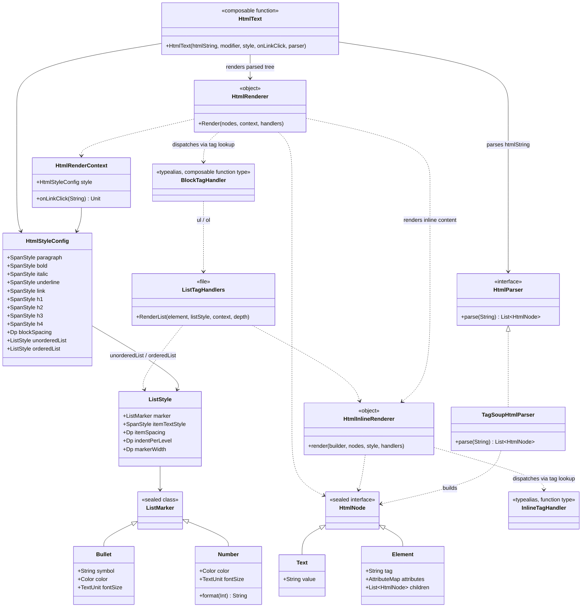
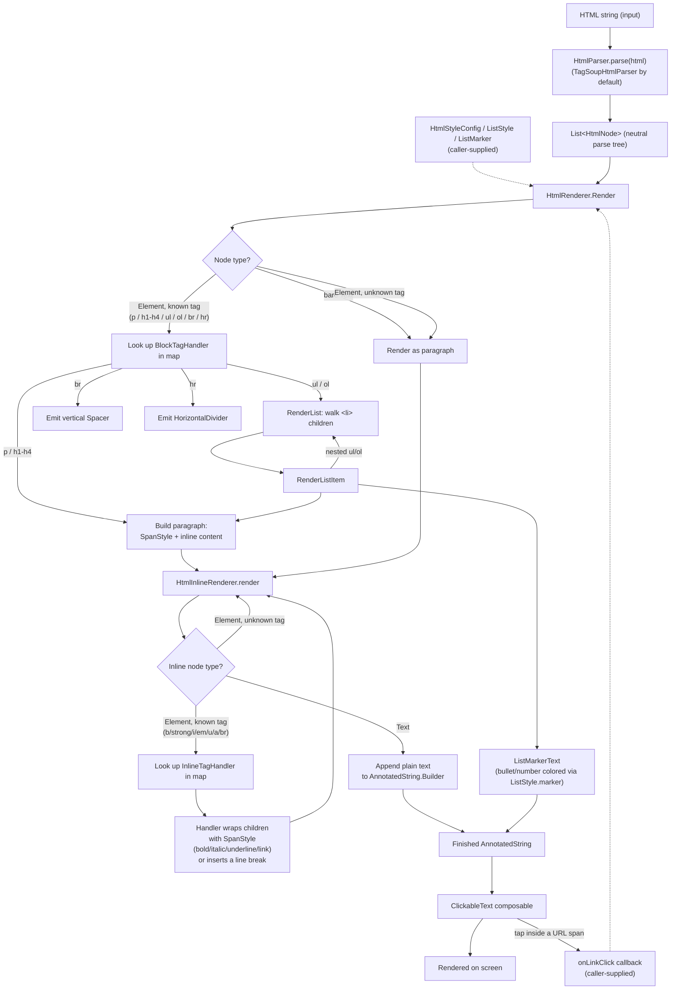

# HTML Compose Renderer

A small Android app that renders an HTML-tagged string as native Jetpack Compose UI (no
`WebView`), with per-tag style customization.

## Supported tags

`i`, `em`, `b`, `strong`, `u`, `s`, `strike`, `del`, `sub`, `sup`, `a`, `br`, `hr`, `p`, `ul`, `ol`,
`li`, `h1`–`h4`.

Unknown tags fall back to rendering their text content inline instead of failing.

## Features

- Pass an HTML string to `HtmlText(htmlString = ...)` and get back real Compose `Text`/`Row`/`Column`
  content — fully themeable, accessible, and measured like any other Compose UI.
- Per-tag styling via `HtmlStyleConfig`: font size/weight/color for bold/italic/underline/links
  and headings, independently of every other tag.
- Custom bullet/number color, symbol, and spacing for `<ul>`/`<ol>` via `ListStyle`/`ListMarker`
  (nested lists are supported and indent automatically).
- `<a>` clicks are exposed via an `onLinkClick(url)` callback.
- The HTML parsing library (TagSoup, via `TagSoupHtmlParser`) is swappable without touching any
  rendering code - `HtmlText` only depends on the `HtmlParser` interface.

## Project structure

```
app/src/main/java/com/mj/htmlrender/
├── MainActivity.kt            - demo screen with sample HTML + custom style
└── html/
    ├── HtmlText.kt             - public @Composable entry point, wires the layers together
    ├── model/HtmlNode.kt       - library-agnostic parse tree (Text / Element)
    ├── parser/
    │   ├── HtmlParser.kt       - parsing abstraction
    │   └── TagSoupHtmlParser.kt- TagSoup-backed implementation (only file that imports TagSoup/SAX)
    ├── style/HtmlStyleConfig.kt- HtmlStyleConfig, ListStyle, ListMarker
    └── render/
        ├── HtmlRenderContext.kt
        ├── InlineTagHandlers.kt  - InlineTagHandler + b/strong/i/em/u/a/br strategies + registry
        ├── HtmlInlineRenderer.kt - dispatches inline nodes to their InlineTagHandler
        ├── BlockTagHandlers.kt   - BlockTagHandler + p/h1-h4/ul/ol/br strategies + registry
        ├── HtmlRenderer.kt       - dispatches block nodes to their BlockTagHandler
        ├── HtmlParagraph.kt      - shared HtmlParagraph composable + inline-AnnotatedString helper
        └── ListTagHandlers.kt    - ul/ol/li rendering: markers, nesting
```

## Architecture

The renderer is a layered pipeline (**parse → model → style → render**) with a **Strategy
pattern** for per-tag behavior: each tag has its own small handler, and adding a new tag never
requires touching the dispatch logic (Open/Closed). `HtmlText` depends on the `HtmlParser`
interface rather than a specific parsing library directly (Dependency Inversion), so the parsing
library can be swapped by passing a different `parser` argument.

### UML class diagram



### Data flow diagram



## Customizing styles

```kotlin
val customStyle = HtmlStyleConfig(
    bold = SpanStyle(fontWeight = FontWeight.Bold, fontSize = 20.sp, color = Color(0xFFD32F2F)),
    unorderedList = ListStyle(
        marker = ListMarker.Bullet(symbol = "●", color = Color(0xFFF57C00)), // orange circle
    ),
    orderedList = ListStyle(
        marker = ListMarker.Number(color = Color(0xFF6A1B9A)),
    ),
)

HtmlText(
    htmlString = "<p>Hello <b>world</b></p><ul><li>One</li><li>Two</li></ul>",
    style = customStyle,
    onLinkClick = { url -> /* open it, e.g. via LocalUriHandler */ },
)
```

## Extending: adding a new tag

Adding a tag never requires touching `HtmlInlineRenderer`/`HtmlRenderer`:

1. Write a handler function matching `InlineTagHandler` or `BlockTagHandler`.
2. Add one entry to `defaultInlineTagHandlers` or `defaultBlockTagHandlers`.

## Building

```
JAVA_HOME=<Android Studio's bundled JBR>
ANDROID_HOME=<your Android SDK>
gradle assembleDebug
```

Or simply open the project folder in Android Studio and run — it will generate the Gradle
wrapper jar automatically on sync.
